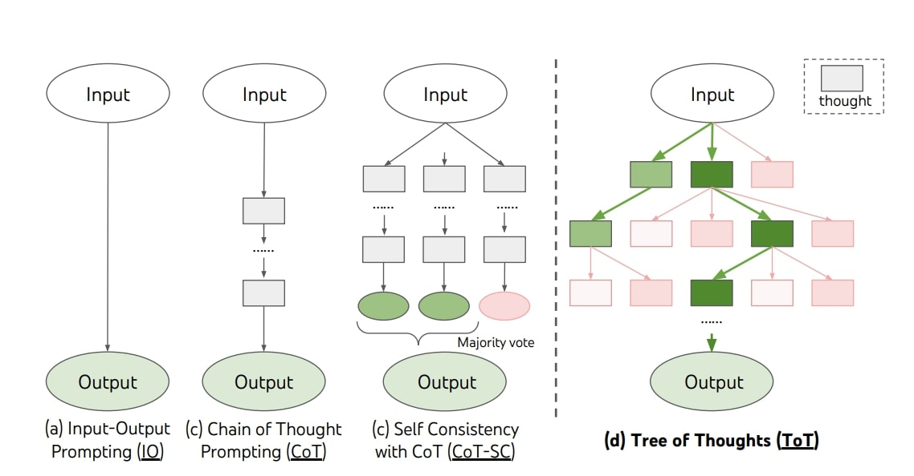

# neural networks:
- **Input Layer**: Data is fed into the neural network through the input layer. Each neuron in this layer represents a feature of the input data.
- **Hidden Layers**: After the input layer, there are one or more hidden layers, which are where the computation is done. Each layer consists of units (neurons) that transform the - input data into something that the output layer can use.
- **Weights and Biases**: Neurons in successive layers are connected through weights. These weights are parameters that the network learns during training. Each neuron also has a bias, allowing the model to fit the training data better.
- **Activation Function**: Each neuron in the hidden layers processes the inputs by performing a weighted sum (dot product of inputs and weights, plus a bias) and then applies an activation function. The activation function introduces non-linear properties to the network, allowing it to learn more complex tasks.
- **Output Layer**: The final layer is the output layer. It brings together the computations and transformations from the hidden layers to form the output, depending on the task (e.g., classification, regression).

## Learning Process (Training):

- **Forward Propagation**: The data flows from the input layer through the hidden layers to the output layer. This process provides the initial output for the training data.
- **Loss Function**: The network's prediction is compared to the actual target values, and the difference is calculated using a loss function. This function quantifies how far off the predictions are.
- **Backpropagation**: This process involves going back through the network and adjusting the weights and biases to minimize the loss function. It's based on the gradient descent optimization algorithm, where the gradient of the loss function with respect to each weight is computed, and the weights are updated in the direction that reduces the loss.
- **Epochs**: The process of feeding the network with the entire dataset and updating each weight is called an epoch. The network typically needs many epochs to learn the patterns in the data effectively.

**Compute the gradient**: 

    - grad = (2 / 3) * X.T @ (X @ w - y)
    - w: input matrix
    - y: actual output
    - 2: derivative of the squared term in the cost function

**Update weights**

    - w_new = w - alpha * grad

## Weights and biases

**Weights Initialization**:
Initializing weights to zero: This is not advisable because if every neuron in the hidden layer starts with the same weight, they will all follow the same gradient and learn the same features during training, which is not useful. This problem is known as the "symmetry breaking problem".
Random Initialization: Weights are usually initialized randomly. This breaks the symmetry and allows the neurons to learn different things. The random values are typically small, often drawn from a normal (Gaussian) distribution with a mean of 0 and a small standard deviation, or a uniform distribution within a small range around zero. This helps in starting the optimization in a random position, which is crucial for the model to learn diverse patterns during training.

**Bias Initialization**:
- Biases can be initialized to zero. Unlike weights, initializing biases to zero is not problematic. The asymmetry breaking comes from the random initialization of weights.
- However, sometimes biases are also initialized with small random values, depending on the specific activation function used in the neurons or specific practices in certain model architectures.
- In specific data science projects, the initialization of weights and biases can be influenced by the architecture of the model, the type of problem (classification, regression, etc.), and the activation functions used. Here are some common practices:

    - Deep Learning / Neural Networks: Advanced techniques like Glorot initialization (also known as Xavier initialization) or He initialization are used, especially for deep networks, to keep the scale of gradients roughly the same in all layers.
    - Convolutional Neural Networks (CNNs): Similar principles apply, but due to the structure of convolutional layers, specific patterns like He initialization or LeCun initialization are often used.
    - Recurrent Neural Networks (RNNs): These might require even more careful initialization to prevent issues with vanishing or exploding gradients, often initializing weights in a certain way to maintain the scale of gradients and the scale of the state through time.

## learning rate optimization

- Andrej Karpathy A Recipe for Training Neural Networks: https://karpathy.github.io/2019/04/25/recipe/

### Learning Rate Schedules:
- **Stochastic gradient descent**: learning in batches
- **Time-based decay**: Gradually reduce the learning rate over time. For example, you might decrease the learning rate by a factor every few epochs.
- **Step decay**: Reduce the learning rate by a factor after a specific number of epochs. For instance, halve the learning rate every 5 epochs.
- **Exponential decay**: Decrease the learning rate exponentially, making smaller adjustments as training progresses.

### Adaptive Learning Rates:
- **Adagrad**: Adjust the learning rate for each parameter based on the past gradients. It gives frequently occurring features very low learning rates and infrequent features high learning rates.
- **RMSprop**: Similar to Adagrad but addresses its aggressive, monotonically decreasing learning rate by using a moving average of squared gradients.
- **Adam** (Adaptive Moment Estimation): Combines ideas from RMSprop and momentum by keeping an exponentially decaying average of past gradients and squared gradients.

## Pytorch vs Keras
- [https://www.youtube.com/watch?v=YZ6q1_kL51k] !!!!!!!
- Keras is for deployment and kubernetes
- pro jest robienie w pytorch i deploy w keras przez onnx
- sprawdz ich modele i dane!!!!

### Pytorch
- Core PyTorch functionality revolves around its primary features:
- Tensors: PyTorch's fundamental data structure, similar to NumPy arrays, but with GPU support for faster computation.
- Autograd Module: Enables automatic differentiation for all operations on Tensors. It's a critical component for training neural networks.
- Neural Networks Module (torch.nn): Provides the building blocks for neural networks like layers, cost functions, etc.
- Optimizers (torch.optim): Contains algorithms like SGD, Adam, etc., for optimizing neural network parameters during training.
- Utilities for Datasets and Dataloaders: Streamline data preprocessing, augmentation, and iteration during training/testing.
- GPU Acceleration: Seamless switching between CPU and GPU to accelerate computations.

## Types
- **FNNs** are the simplest, used for straightforward tasks.
- **CNNs** excel in processing data with spatial relationships (images).
- **RNNs and LSTMs** are suited for sequential data, with LSTMs being an enhancement over RNNs to capture longer dependencies.

### Feedforward Neural Networks (FNNs):
- **Structure**: Comprises input, hidden, and output layers. Signals travel in one direction from input to output.
- **Use Cases**: Basic tasks like image recognition (when complexity is low) and classification problems.
- **Characteristics**: No internal state is maintained, making it less suitable for tasks where context or sequence is important.

### Convolutional Neural Networks (CNNs):
- **Structure**: Consists of convolutional layers, pooling layers, and fully connected layers. Designed to process data in a grid pattern (like images).
- **Use Cases**: Image and video recognition, image classification, and any task that requires capturing spatial hierarchies.
- **Characteristics**: Excellent at capturing spatial relationships in data. Uses parameter sharing and sparsity of connections to be more efficient in terms of computation and parameters.

### Recurrent Neural Networks (RNNs):
- **Structure**: Nodes form a directed graph along a temporal sequence, allowing it to exhibit temporal dynamic behavior.
- **Use Cases**: Time series prediction, natural language processing, and any task that involves sequential data.
- **Characteristics**: Can process sequences of data, maintaining an internal state from previous inputs to influence current inputs. Challenges include difficulty in training (vanishing and exploding gradient problems).

### Long Short-Term Memory Networks (LSTMs):
- **Structure**: A special kind of RNN, capable of learning long-term dependencies, using gates (input, forget, and output gates).
- **Use Cases**: Language modeling, speech recognition, and complex sequence prediction problems where context from long sequences is crucial.
- **Characteristics**: Addresses vanishing gradient problem of RNNs by incorporating a memory cell that can maintain information in memory for long periods. More complex and computationally expensive than standard RNNs.

# Graphs GNN

# DIFFUSION
Diffusion models are a class of generative models that learn to create data similar to a given distribution. They are particularly known for generating high-quality images. The process involves two main phases: the forward (diffusion) process and the reverse (denoising) process.

# NLP
Traditional NLP methods heavily relied on statistical techniques and linguistic rules. Approaches like Bag of Words, TF-IDF, and n-grams would convert text into a numerical format that machine learning models could understand, essentially treating text as a collection of independent tokens or phrases.

Neural networks introduced a significant shift in NLP with the ability to understand and represent the context of words in a sentence, moving beyond the limitations of traditional models. Here's how neural networks are integrated into NLP:

- **Word Embeddings** (e.g., Word2Vec, GloVe): Instead of treating words as separate entities, word embeddings represent them in a continuous vector space, capturing semantic similarity based on context. Words with similar meanings are placed closer together in this space.
- **Recurrent Neural Networks (RNNs) and Long Short-Term Memory (LSTM) networks**: These architectures are designed to handle sequences of data, like sentences. They can remember information for a long period, which is essential for understanding context and meaning in text.
- **Attention Mechanisms and Transformers**: Attention mechanisms allow models to focus on different parts of the input sequence when producing an output, improving the model's ability to understand context and relationships in the text. Transformers, introduced in the paper "Attention is All You Need," use self-attention mechanisms to process input data in parallel and capture complex word dependencies.
- **Pre-trained Language Models** (e.g., BERT, GPT): These models are trained on vast amounts of text and then fine-tuned for specific tasks. They can understand context, nuance, and even generate human-like text. 

## Embeddings
When you handle multiple words or an entire sentence, you stack these vectors, and they form a matrix. Here's how it works step by step:
- **Individual Word Embeddings**: Suppose you have a vocabulary of 10,000 words and you choose to represent each word with a 300-dimensional vector. Each word is then associated with a unique 300-number-long vector.
- **Sentence or Document Representation**: When you want to represent a sentence or a document, you take each word's embedding and stack them. For instance, a sentence with 10 words, each represented by a 300-dimensional vector, will result in a 10x300 matrix.

This matrix serves as the input to further neural network layers. In this matrix:
- Each row corresponds to a word in the sentence.
- Each column in a row corresponds to a dimension in the word's embedding.

# Attention
## Self attention mechanism
- The core idea of the self-attention mechanism is to allow each position in the input sequence to attend to all positions in the same sequence to compute a representation of the sequence. It does this by calculating three vectors for each input token: a query vector, a key vector, and a value vector.
- The attention mechanism then computes a score by taking the dot product of the query vector with the key vector of every other token. These scores determine how much focus to put on other parts of the input sequence when encoding a particular token. https://twitter.com/karpathy/status/1864023344435380613/photo/1

Nvidia: Star attention (https://www.marktechpost.com/2024/11/28/nvidia-ai-research-unveils-star-attention-a-novel-ai-algorithm-for-efficient-llm-long-context-inference/?ref=dailydev)

# Transformers

In the paper "Attention is All You Need" and in Large Language Models (LLMs) like GPT or BERT, the importance of different parts of the input data is determined dynamically for each task or context through the mechanism of attention, specifically self-attention in transformers. 

The core innovation of the Transformer is the self-attention mechanism, which allows the model to weigh the influence of different parts of the input data when processing each word.

Here's how it works:

https://x.com/Hesamation/status/1875306553286471871?t=1VfK6-_r178iQPuxzSY2dg&s=19
[TRANSFORMER EXPLAINER](https://poloclub.github.io/transformer-explainer/)
[The Illustrated Transformer](https://jalammar.github.io/illustrated-transformer/)
[More detailed architecture for LLama3 and Mistral](https://levelup.gitconnected.com/building-llama-3-from-scratch-with-python-e0cf4dbbc306)

https://youtu.be/e9-0BxyKG10?si=I0uN8FO_F7E71-2P

- **Self-Attention Mechanism**.   

- **Positional Encodings**:
    - Since Transformers process the input tokens in parallel, they don't inherently capture the sequential order of the tokens. Positional encodings are added to the input embeddings to provide this sequence information, allowing the model to consider the position of each token when processing the text.    

- **Layer Structure**:
    - A Transformer model is composed of an encoder and a decoder, each consisting of multiple layers. Each layer in the encoder and decoder contains a self-attention mechanism and a feedforward neural network. In the encoder, layers process the input sequence, capturing the context and relationships. In the decoder, layers generate the output sequence, one token at a time, conditioned on the input sequence and the previously generated tokens.

- **Determining Importance**:
    - The scores obtained from the dot product are passed through a softmax function, which converts them into probabilities. The softmax output indicates the importance of each token relative to the other tokens in the sequence.
    - The model then takes a weighted sum of the value vectors, where the weights are determined by the softmax output. This process allows the model to aggregate information from the entire sequence, with more important or relevant tokens getting higher weights.

- **Parallel Processing** :
    - Unlike RNNs that process data sequentially, Transformers process all tokens in the input simultaneously. This allows for more efficient training and better scalability with longer sequences.

**In LLMs**:
In the context of Large Language Models like GPT, BERT, or T5, this attention mechanism allows the model to consider the entire context of a sequence when making predictions or generating text. For example:
- **In Translation Tasks**: The model can focus on subject-verb agreement, adjective-noun pairing, or contextual cues that are crucial for accurate translation.
- **In Text Generation**: The model can generate coherent and contextually relevant text by focusing on relevant parts of the input prompt or previous tokens in the sequence.
- **In Understanding Tasks (like Q&A)**: The model can focus on the parts of the context or the question that are most relevant to generating a correct and precise answer.

The beauty of the self-attention mechanism is its flexibility and dynamic nature. It does not rely on hardcoded rules to determine relevance or importance but learns these patterns from the data. As the model is trained on a task, it learns to pay more attention to the input parts that are more informative for that task. This allows transformers to be highly effective across a wide range of applications and to handle complex dependencies and relationships in the data.

# LLMs
In Large Language Models (LLMs) the process of understanding and generating text involves several layers of computation, with each layer designed to capture different aspects of language understanding and generation. Here's a simplified overview of the steps involved when a user's input (question) is processed by an LLM:

- **Tokenization and Embedding**:
    - **Tokenization**: The input text (user's question) is broken down into tokens. These tokens could be words, parts of words, or even characters, depending on the model's design.
    - **Embedding**: Each token is then converted into a numerical vector using word embeddings. This results in a matrix where each row represents a token in the input.

- **Positional Encoding (specific to models like Transformers)**:
    - To retain the order of words, positional encodings are added to the embeddings. This ensures that the model not only understands the individual words but also the sequence or order in which they appear.

- **Passing through Neural Network Layers**:
    - The matrix (embeddings + positional encodings) is passed through multiple layers of the neural network. In models like Transformers, these layers are primarily composed of self-attention mechanisms and feedforward neural networks:
        - Self-Attention: This mechanism allows the model to weigh the importance of other words in the input for understanding each specific word. It essentially helps the model to gather context from the entire input.
        - Feedforward Neural Networks: These layers process the output from the attention mechanisms further, capturing more complex patterns and relationships in the data.

- **Output Generation**:
    - For each input token, the final layer of the model produces a vector.
    - This vector is then projected onto the vocabulary space (using a linear layer followed by a softmax function), turning it into a probability distribution over all possible next words (in case of generative models like GPT) or over possible labels or classes (like in classification tasks for models like BERT).
    - For generative models, this process is repeated iteratively, with each step generating a new token until a stop condition is met (like an end-of-sequence token is generated).

- **Fine-tuning for Specific Tasks** (optional):
    - While the core model is trained on a large corpus of text to understand language in general, it can be fine-tuned on specific tasks or datasets. This involves additional training steps where the model's parameters are slightly adjusted to perform well on a specific type of input or to better understand the context of certain domains.

In summary, LLMs transform user input into vectors, process these through complex layers capturing various linguistic features and relationships, and finally output a response or classification by converting the complex internal representations back into human-understandable language or decision labels.

https://github.com/SylphAI-Inc/LLM-engineer-handbook#serving
A curated list of Large Language Model resources, covering model training, serving, fine-tuning, and building LLM applications.

## Foundation Models and chats

- Bare GPT Models:
    - These are the foundational models trained to predict the next word in a sequence of text, learning to generate coherent and contextually relevant text.
    - The bare model's primary function is text generation, and it can be used for tasks like text completion, creative writing, and more.
    - The model is autoregressive, generating text one word at a time, based on the sequence of words that came before it.

- Chat Models or Conversational Agents:
    - These are specialized versions of GPT models that are fine-tuned or further trained to handle conversational text. They are designed to engage in dialogue, providing responses that are contextually appropriate and coherent.
    - These models may have additional layers or mechanisms to handle the nuances of conversation, such as maintaining context over several turns of dialogue, managing coherency over longer conversations, and sometimes even personalization or style adjustments to match the tone or context of the conversation.
    - They are often fine-tuned on conversational datasets or optimized to generate responses that are not just contextually relevant but also engaging, informative, and appropriate for the conversational setting.

# mixture of experts
https://huggingface.co/blog/moe
[https://huggingface.co/blog/moe](https://huggingface.co/blog/moe)

# MODEL OPTIMIZATION

- **Fine tuning**
- **Prompt engineering**
- **Few shots learning** (for classification)
- **Model distillation**

# Fine tuning
training new model parameters (weights, no. of layers, training rate, add regularization, tweaking optimizer)

[Fine-tuning Large Language Models (LLMs) | w/ Example Code](https://www.youtube.com/watch?v=eC6Hd1hFvos)

basically QLORA (co to QLORA ?!?!?!)

task: to get completions, summarizations, chats, classification

## 3 ways to finetune:
- self supervised: new corpus / knowledge injection
- supervised: input / output -> here you use prompt templates (e.g. please answer the following question...)
- reinforcement learning (RL)
    - supervised ft
    - train reward model (one prompt, multiple answers, ranking, train reward model)
    - reinforcement learning with RL algorithm

## Supervised Fine-tuning / 5 steps:
- choose finetuning task
- prepare training dataset
- choose base model
- fine tune model via supervised learning
- evaluate model performance

## 3 Options for parameter training
- retrain all parameters
- transfer learning: finetuning only last layer
- parameter efficient fine tuning: freezing all weights, only adding new weights
    - LORA: dodajesz nową macierz wag, ale pod postacią 2 wektorów, które się mnożą)

## How to create synthetic dataset:
 Take company docs
- Chunk it
- Ask ollama to create questions based on chunks
- Ask ollama to answer the said questions based on chunks (done seperately to ensure verbose answer)
- Any embedding model to verify if the answer is def related to the chunk
- Maybe some keyword matches
- Pending step to remove further hallucinations (ask GPT-4/Mistral-medium to rate it from 1 to 5??)
- A decent dataset acquired

# USING MODELS 
- Ollama - do sciagania modeli lokalnie (Linux)

# RAGS
sth

# REASONING

Jest jeszcze [Chain of abstractions:](https://huggingface.co/papers/2401.17464): first step is to train nn to generate abstract multistep chain:

# PLATFORMS
- https://fireworks.ai/models : platforma deveoperska, hostująca m.in. stable diffusion

# FRAMEWORKS
- **Langchains** robi chainy dzialan, Build context-aware, reasoning applications
- **LlamaIndex:** architektura do ragów (applications to ingest, structure, and access private or domain-specific data) + embeddings + routing + FT -> dziala z ollama
- Prompt Flow, Langchain, Semantic Kernel, AutoGen

# CLOUD
- Azure: port OpenAI, finetuning gpt-35-turbo-0613, prosty interface do finetuningu [LINK](https://learn.microsoft.com/en-us/azure/ai-services/openai/overview)
- GCP: Kubeflow - the machine learning toolkit for Kubernetes.
- GCP: https://cloud.google.com/tpu
- GCP: Vertex

# MULTIAGENTS

- Autogen
- https://crewai.net/

# TRENDS
- Mistral 7B i Gemini Pro
- On Huggingface CodeLLama, Instruct i Mixtral 8x7B,,,,, LLama2, phi-2
- multiagent

# wazne
[@ShawhinTalebi -YT](https://www.youtube.com/@ShawhinTalebi)

[Chatbot Arena](https://huggingface.co/spaces/lmsys/chatbot-arena-leaderboard)

[https://gptranked.com/](https://gptranked.com/)

Jakie open sourcowe modele na Hugging Face wspierają Lorę?
Jakie są teraz trenndy w Finetuning 
Czy w modelach na Hugging Face mozna wydobyc layers for particular tasks?
https://cloud.google.com/tpu/docs/tutorials/transformer-2.x

# NVIDIA

- https://www.cnbc.com/2024/03/18/nvidia-announces-gb200-blackwell-ai-chip-launching-later-this-year.html
- https://news.ycombinator.com/item?id=39749646
